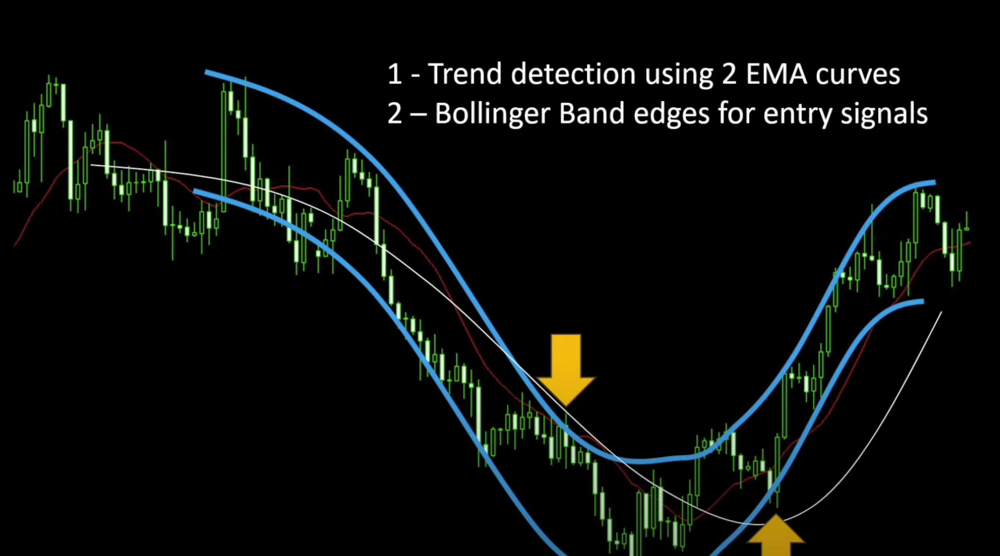

https://www.youtube.com/watch?v=C3bh6Y4LpGs

1. Trend detection using 2 EMA curves
2. Bollinger Band edges for entry signals

Price will converge the centre

coefficient: a numerical or constant quantity placed before and multiplying the variable in an algebraic expression (e.g. 4 in 4x y).
